# 🎓 ETEC Zona Leste – Recriação do Site Institucional

## 📚 Índice

- [📌 Sobre o Projeto](#-sobre-o-projeto)
- [🎯 Objetivos](#-objetivos)
- [🖥️ Telas do Projeto](#️-telas-do-projeto)
- [⚙️ Funcionalidades](#️-funcionalidades)
- [🚀 Tecnologias Utilizadas](#-tecnologias-utilizadas)
- [▶️ Como Executar](#️-como-executar)
- [📬 Contato](#-contato)
- [📚 Observações](#-observações)

## 📌 Sobre o Projeto

Este projeto consiste na recriação do site institucional da **ETEC Zona Leste**, com foco em modernização visual, organização de código e melhoria da experiência do usuário.

A proposta foi desenvolver uma versão mais atual, organizada e funcional do site, mantendo a identidade institucional, mas com uma navegação mais intuitiva, melhor hierarquia visual e páginas mais atrativas.

---

## 🎯 Objetivos

- Criar uma interface moderna e intuitiva  
- Melhorar a experiência do usuário  
- Desenvolver um site responsivo  
- Aplicar boas práticas de desenvolvimento  
- Utilizar PHP para formulário  
- Organizar a estrutura do projeto de forma clara  

---

## 🖥️ Telas do Projeto

### 🏠 Página Inicial

  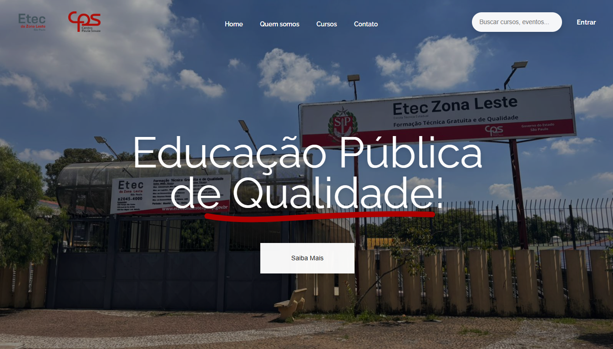  
  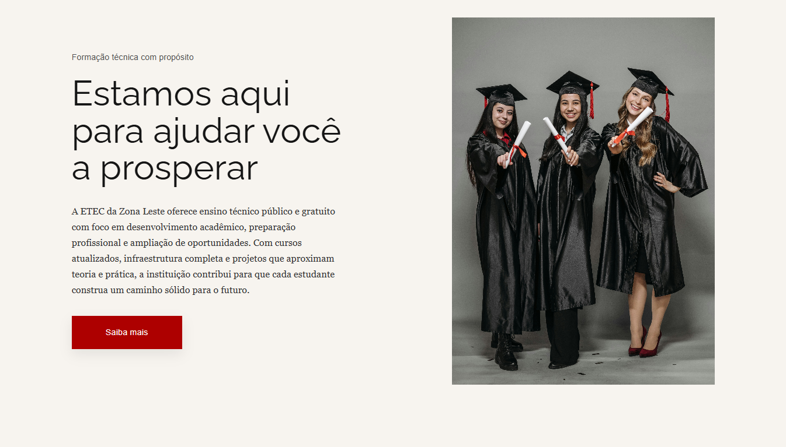  
  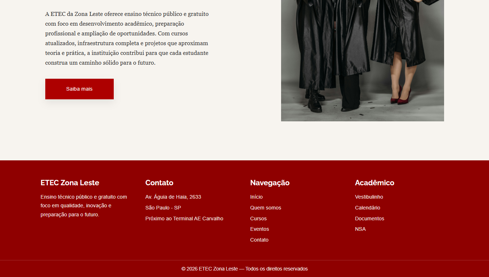

---

### 🏫 Quem Somos

  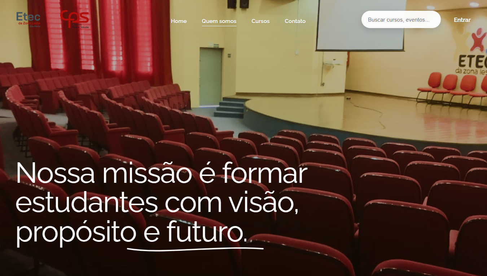  
  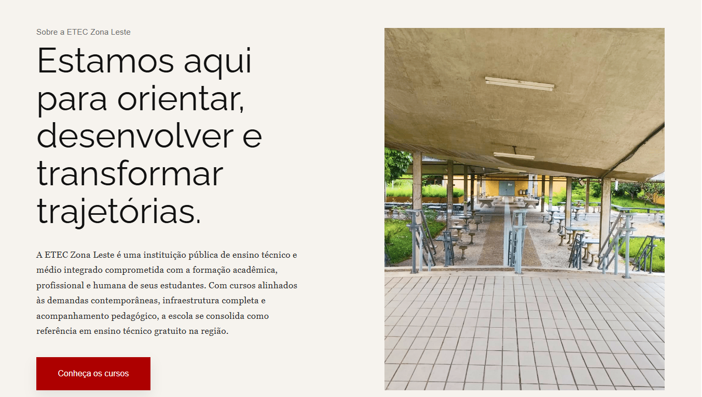  
  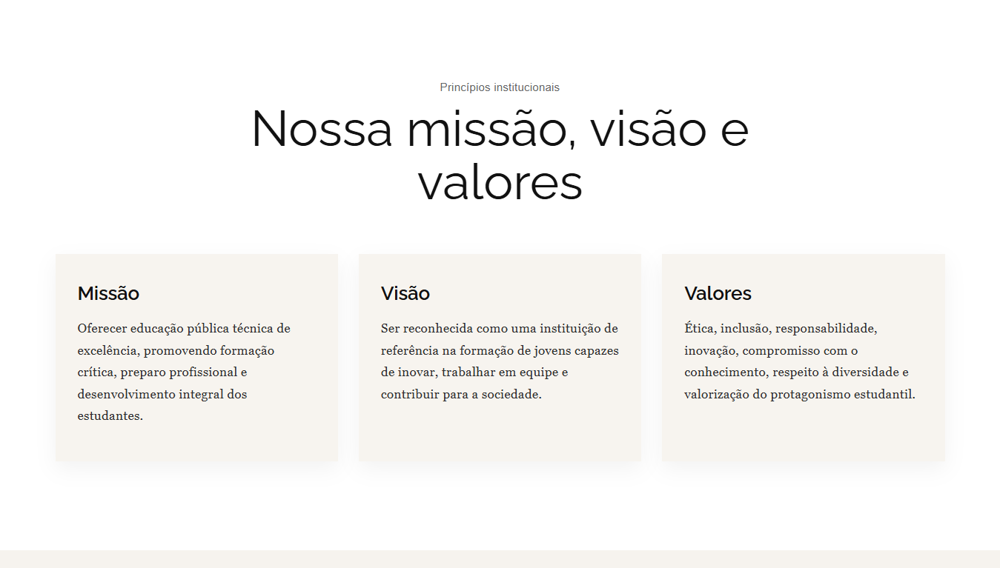  
  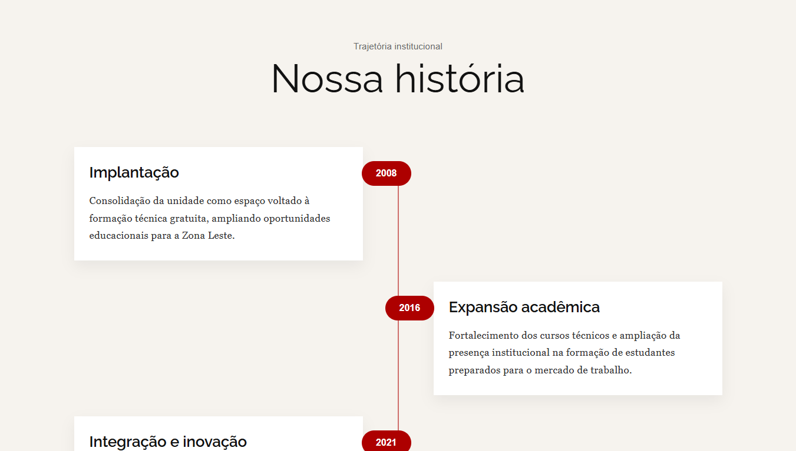  
  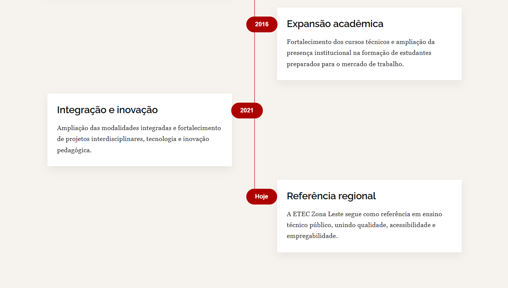  
  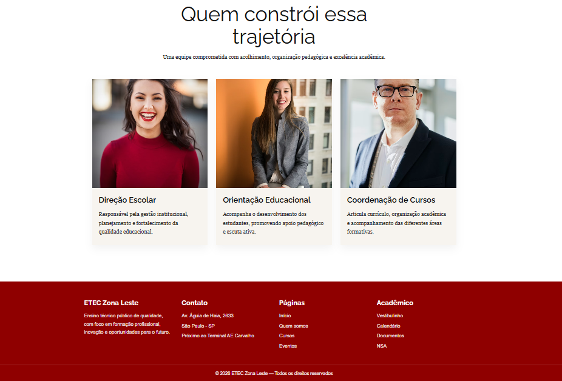

---

### 📚 Cursos

  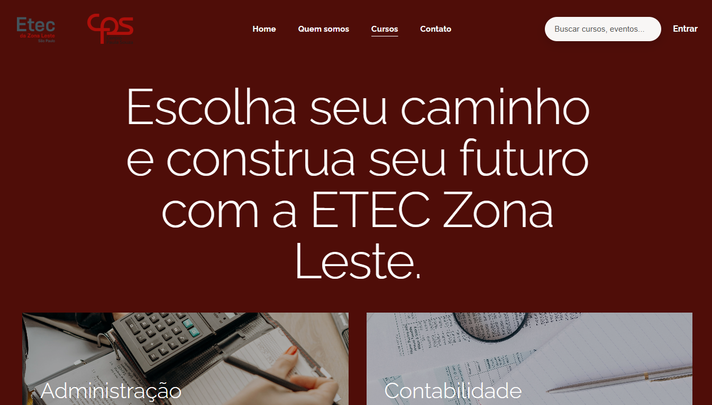  
  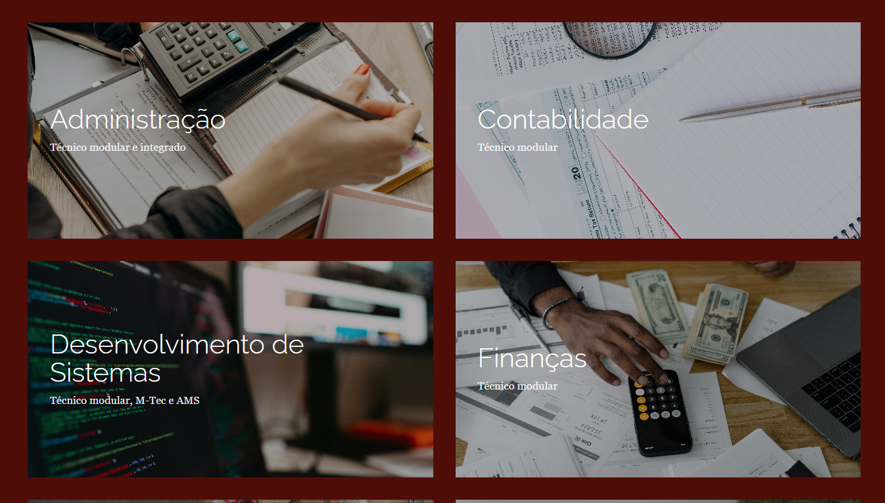  
  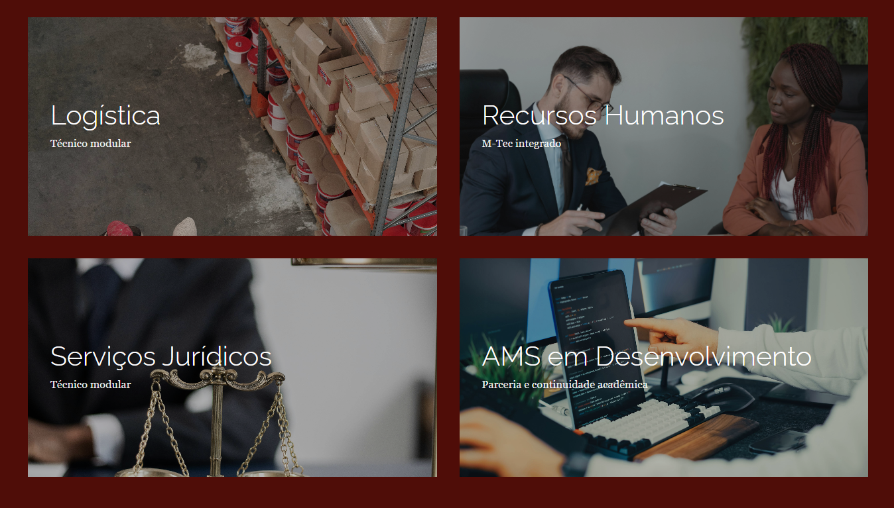  
  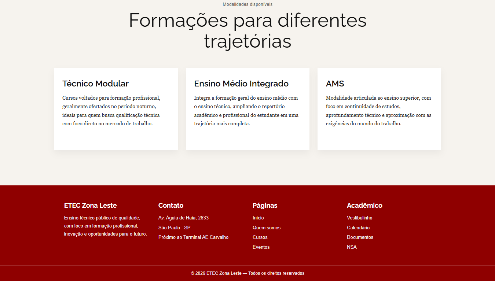

---

### 📩 Contato

  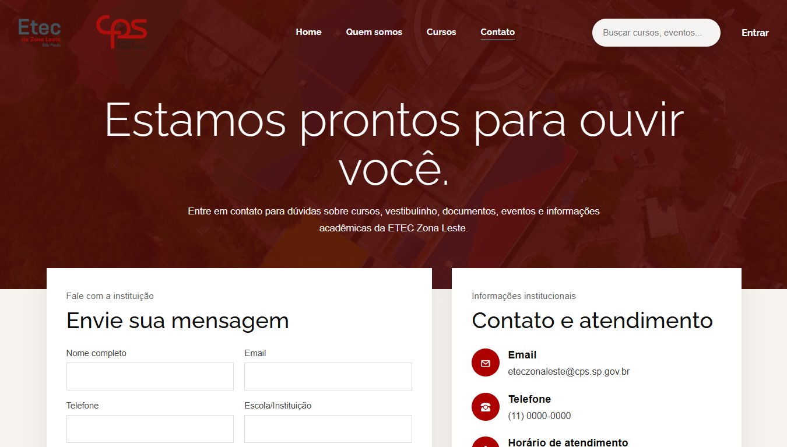  
  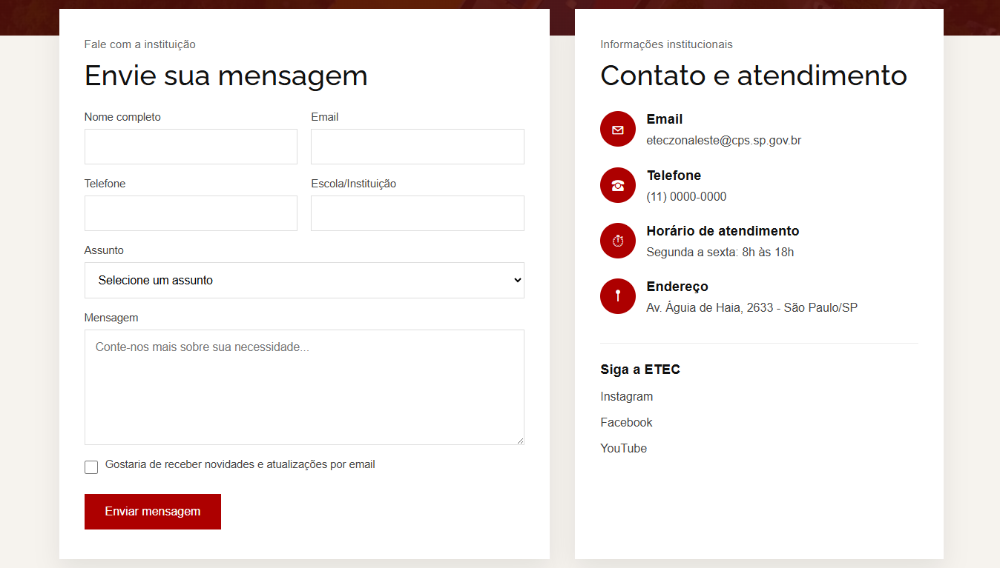  
  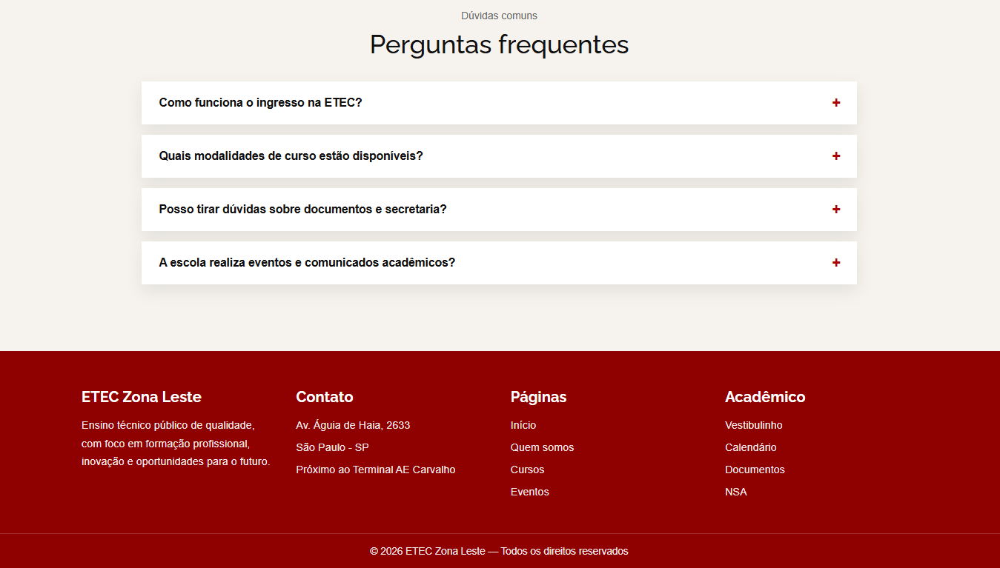

---

## ⚙️ Funcionalidades

- Layout responsivo  
- Navegação entre páginas  
- Animações ao rolar a página  
- Cards interativos de cursos  
- Timeline animada  
- FAQ interativo  
- Formulário funcional com PHP  
- Estrutura organizada em HTML, CSS, JavaScript e PHP  

---

## 🚀 Tecnologias Utilizadas

  

---

## ▶️ Como Executar

1. Clone o repositório:

       git clone https://github.com/queirozmariana/Site-ETEC.git

2. Coloque o projeto na pasta do servidor local, por exemplo no XAMPP:

       htdocs

3. Inicie o Apache no seu servidor local.

4. Acesse no navegador:

       http://localhost:3000/Pages/index.html

5. Para testar o formulário com PHP, utilize a página de contato integrada ao arquivo de envio.

---

## 👩‍💻 Autoria

**Mariana Pereira de Queiroz**  
Projeto acadêmico desenvolvido no curso de **Desenvolvimento de Sistemas (AMS)**.

---

## 📬 Contato

  
  

---

## 📚 Observações

Projeto desenvolvido com fins educacionais.  
Sem vínculo oficial com a ETEC Zona Leste ou com o Centro Paula Souza.
